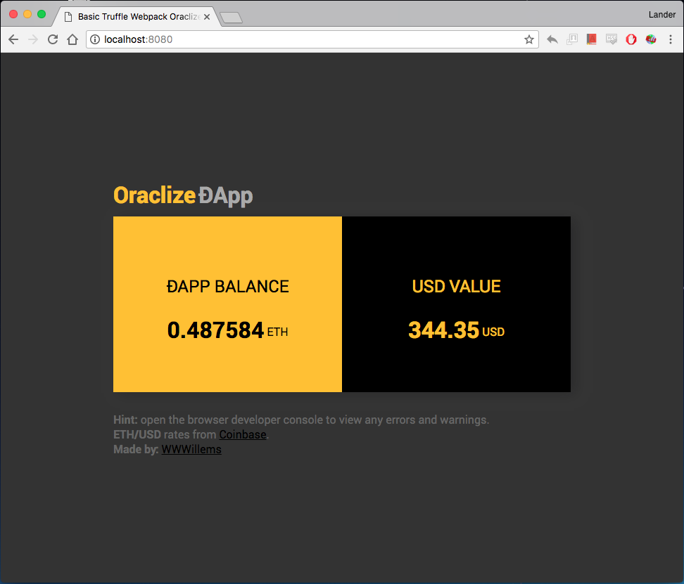

## An Oraclize Example ÐApp
#### Screenshot

#### About
This is a project I made around Oraclize.

It's a simple HTML/JavaScript front-end that communicates with a Solidity Smart Contract to fetch the ETH/USD price from the Coinbase API. It uses [Truffle](http://truffleframework.com/), [truffle-webpack](http://truffleframework.com/boxes/webpack) and [ethereum-bridge](https://github.com/oraclize/ethereum-bridge).

*A nice and simple example on how to use Oraclize and Solidity Events to create ÐApps.*

I've created this repository as a reference to [my Medium article](https://medium.com/@WWWillems).

#### Tools used
- Solidity
- Truffle, truffle-webpack
- [ethereum-bridge](https://github.com/oraclize/ethereum-bridge)

#### How to start?
1. Clone this repository
2. Run `npm install`
3. Go to my article and follow allong
4. Run `npm run dev` to start Truffle server
5. Go to `http://localhost:8080` to see the ÐApp.

